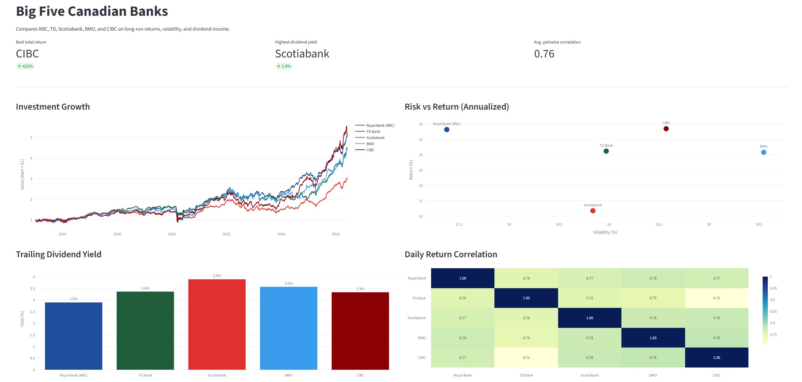

A Python data analysis project comparing Canada’s Big Five banks using historical stock data. Built with Pandas, NumPy, and Plotly to calculate annualized returns, volatility, dividend yields, and return correlations, with interactive visualizations including growth, risk-return, dividend yield, and correlation charts.

 

 demo: https://big-five-banks-of-canada-analysis.streamlit.app/
